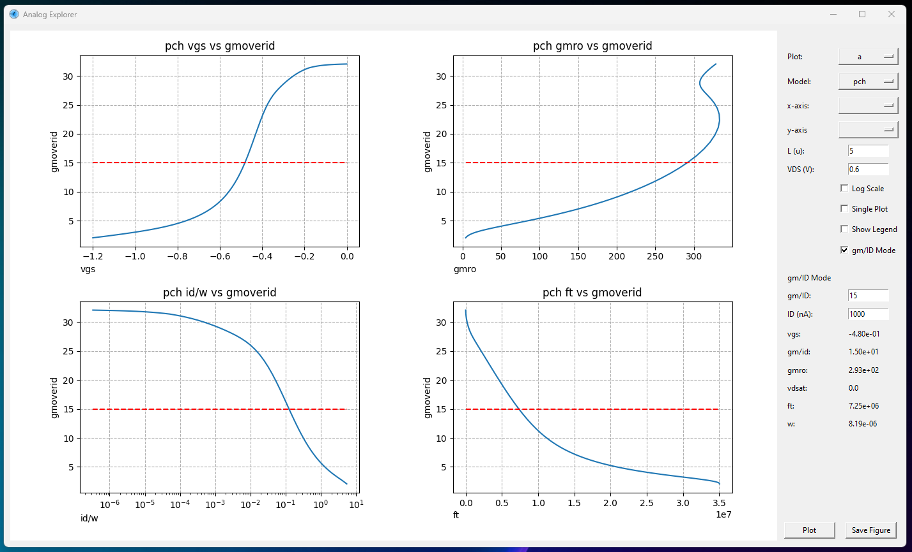
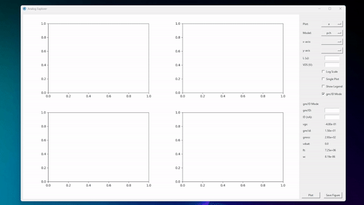
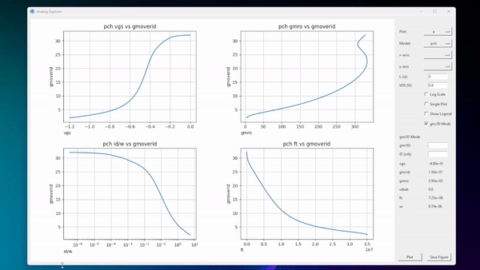
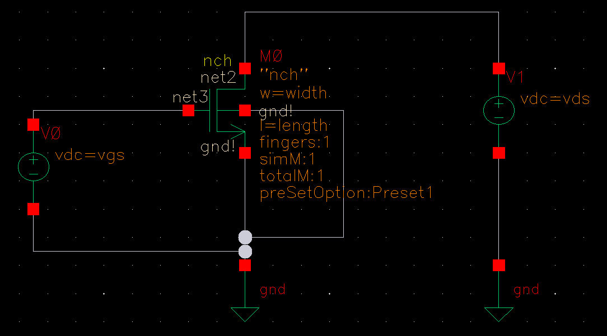
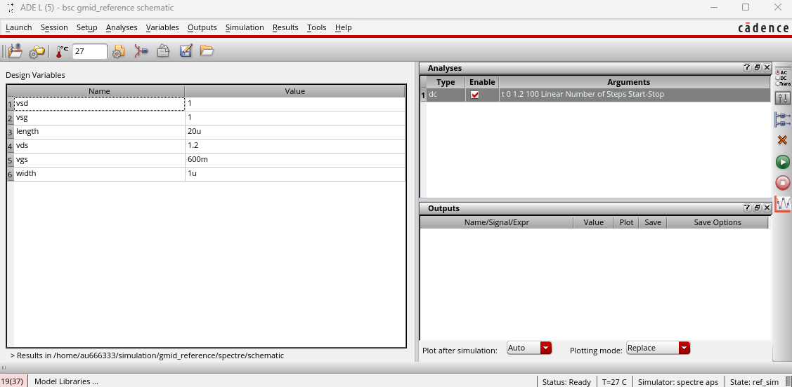
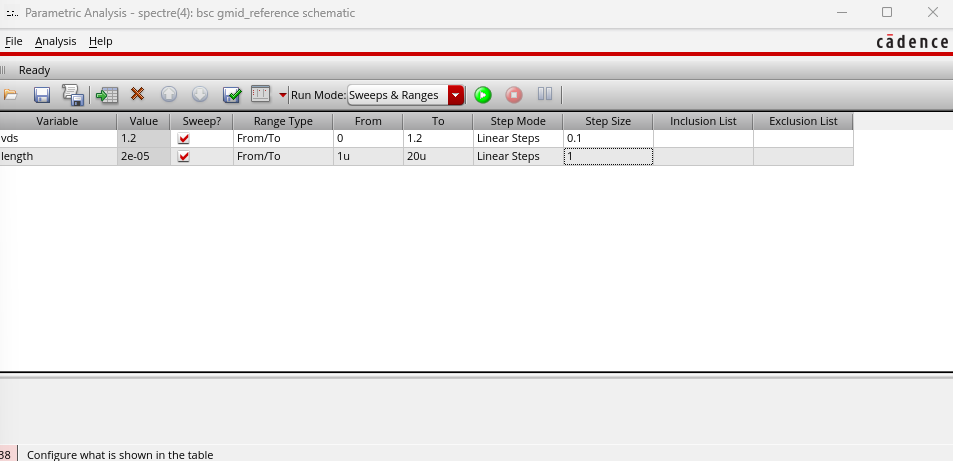
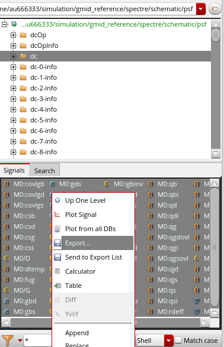

<a name="readme-top"></a>

<br />
<div align="center">
  <a href="https://github.com/Ponti17/analog-explorer">
    
  </a>

<h3 align="center">Analog Explorer</h3>
  <p align="center">
    A graphical user interface for quickly finding transistor operating points.
    <br />
  </p>
</div>

<details>
  <summary>Table of Contents</summary>
  <ol>
    <li>
      <a href="#about-the-project">About The Project</a>
    </li>
    <li>
      <a href="#getting-started">Getting Started</a>
      <ul>
        <li><a href="#prerequisites">Prerequisites</a></li>
        <li><a href="#installation">Installation</a></li>
      </ul>
    </li>
    <li><a href="#how-it-works">How it Works</a></li>
    <li><a href="#license">License</a></li>
  </ol>
</details>

## About The Project

Written as part of my Bsc thesis during spring 2024 to help with the design of several analog CMOS circuits. The tool takes transistor models created with [SPICE](https://en.wikipedia.org/wiki/SPICE) and is designed to be used with the [gm/id method](http://web02.gonzaga.edu/faculty/talarico/EE406/documents/gmid.pdf).

## Usage

Analog explorer present a GUI for exploring the possible design space of CMOS transistors.



Choose a device, input VDS and length, and Analog Explorer will plot relevant figures of merits for determing transistor area, speed, gain and noise.



Input a chosen operating point in terms of gm/ID and a operating current, and Analog Explorer will print exact device characterisatics and dimensions to achieve said performance.



## Getting Started

If you're interested in using this useful tool, you can do the following.

### Prerequisites

Install the following dependencies via pip

   ```sh
   pip install numpy
   pip install matplotlib
   pip install tkinter
   pip install pandas
   ```

### Installation

Clone this repo by

   ```sh
   git clone https://github.com/Ponti17/analog-explorer.git
   ```

### Model Generation

The following steps describe how to generate Analog Explorer compatible models in Cadence Virtuoso.

Place desired model in schematic. If the device is n-type connect it as follows:



It is important to set w=width and l=length as well as naming the sources vgs and vds. Start ADE L and add a dc analysis sweeping vgs from 0 to VDD. Use the following settings.



Note that the values for vgs, vds and length in Design Variables do not matter. It is however important to set the width to 1u. Now select Tools>Parametric Analysis. Sweep vds from 0 to VDD and length from min to max. A smaller step size gives a higher fidelity for the model. Note that the total simulation time quickly increases with lower step sizes. See below for suggested settings.



When the simulation is done go to Tools>Results Browser. Select dc, under signals select all and export as csv.



The model is now finished.


<p align="right">(<a href="#readme-top">back to top</a>)</p>

## License

Distributed under the MIT License. See `LICENSE.txt` for more information.

<p align="right">(<a href="#readme-top">back to top</a>)</p>